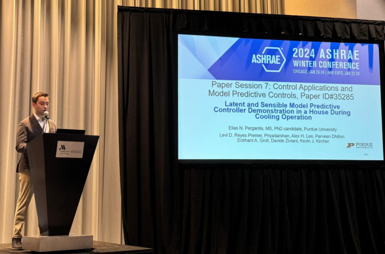

  

 

Thanks for stopping by! I'm a PhD Candidate in the Mechanical Engineering Department and <a href="https://engineering.purdue.edu/Herrick" target="_blank" style="color: black; text-decoration: underline;">Herrick Laboratories</a> at <a href="https://www.purdue.edu/" target="_blank" style="color: black; text-decoration: underline;">Purdue University</a>, working under the guidance of Profs. <a href="https://kevinjkircher.com/" target="_blank" style="color: black; text-decoration: underline;">Kevin Kircher</a> and <a href="https://engineering.purdue.edu/ME/People/ptProfile?resource_id=164622" target="_blank" style="color: black; text-decoration: underline;">Davide Ziviani</a>. My research centers on developing machine learning, optimization, and control algorithms for heating and cooling systems in residential buildings. I am the recipient of a Recognition award by the Mechanical Engineering at Purdue, a Grant-in-Aid award by ASHRAE, an Onassis Foundation Scholar, and the best poster presentation at the International Energy Heat Pump Conference (Chicago 2023).

Before joining Purdue, I worked as a Graduate Research Assistant at the <a href="https://public.websites.umich.edu/~pramodr/Home.html" target="_blank" style="color: black; text-decoration: underline;">Nanoscale Transport Lab</a> at the University of Michigan Mechanical Engineering Department with a focus on advancing our fundamental understanding of heat transfer, under the supervision of Profs. Pramod Reddy and Edgar Meyhofer. Prior to my work at Michigan, I received my Master of Engineering (MEng) degree with First Class Honours from the University of Bristol (UK), with a focus on Computational Fluid Dynamics (CFD) in wind farms and biofluid applications.

I am actively seeking full-time positions in thermal systems, HVAC, smart controls, machine learning, and other engineering-tech positions focusing on sustainability. I am expected to receive my degree this December.

Here is my <b><a href="https://epergant.github.io/files/CV_Pergantis.pdf" target="_blank" style="color: black; text-decoration:none;">CV</a></b>.

Some more highlights of my work:
- Successfully brought to completion four major projects involving smart control implementations in real-world buildings.
- Developed novel data-based controllers for the coordination of assets (heat pumps, water heaters, PVs, EVs) in residential buildings with significant performance achievement.
- Worked in the development of two novel thermodynamic cycles, one for <a href="https://heatpumpingtechnologies.org/news/1/58534/" target="_blank" style="color: black; text-decoration: underline;">high-temperature heat pumps </a> and another for space conditioning using  <a href="https://www.energy.gov/eere/buildings/articles/no-vapor-compression-electrochemical-looping-heat-pump-novel-hp" target="_blank" style="color: black; text-decoration: underline;">chemical reactions </a>.
- Advised 9 undergraduate and 4 graduate students.
- Worked under major DOE and CHPB (Purdue) funding.
- Presented and co-authored 7 conference papers, 6 in preparation.
- Published 1 journal as first author (Applied Energy IF = 12), 3 in preparation. 
- Reviewer for STBE (ASHRAE), reviewed papers for 10 ASHRAE and Purdue conferences.
