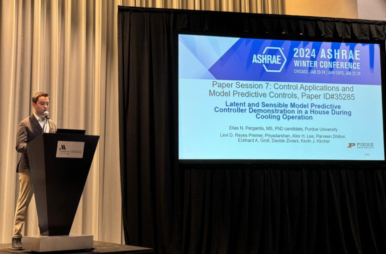

  

 

Thanks for stopping by! I'm a Lead Engineer in the Residential R&D group at <a href="https://www.tranetechnologies.com/" target="_blank" style="color: black; text-decoration: underline;">Trane Technologies</a> in Tyler, TX, where I develop advanced control algorithms for HVAC equipment and thermostats. My work spans model identification from field and lab data, model-based and machine-learning control, hardware-in-the-loop (HIL) testing, and production embedded code generated from Modelica and MATLAB/Simulink. Broader themes include electrification of residential heating, occupant-centric comfort, and grid-interactive building operation.

I received my Ph.D. in Mechanical Engineering from <a href="https://www.purdue.edu/" target="_blank" style="color: black; text-decoration: underline;">Purdue University</a> in December 2024, working at the <a href="https://engineering.purdue.edu/Herrick" target="_blank" style="color: black; text-decoration: underline;">Herrick Laboratories</a> under Profs. <a href="https://kevinjkircher.com/" target="_blank" style="color: black; text-decoration: underline;">Kevin Kircher</a> and <a href="https://engineering.purdue.edu/ME/People/ptProfile?resource_id=164622" target="_blank" style="color: black; text-decoration: underline;">Davide Ziviani</a>. My dissertation focused on forecasting, optimization, and machine-learning algorithms for heating and cooling systems in residential buildings — including model predictive control (MPC), grey-box thermal modeling from operational data, distributed energy resource (DER) coordination, and field deployment across multiple instrumented homes. Before Purdue, I was a Graduate Research Assistant at the <a href="https://public.websites.umich.edu/~pramodr/Home.html" target="_blank" style="color: black; text-decoration: underline;">Nanoscale Transport Lab</a> at the University of Michigan under Profs. Pramod Reddy and Edgar Meyhofer, and earned my Master of Engineering (MEng) with First Class Honours from the University of Bristol (UK) with a focus on Computational Fluid Dynamics (CFD) for wind farms and biofluid applications.

During my Ph.D., I was an Onassis Foundation Scholar and the recipient of an ASHRAE Grant-in-Aid, a Recognition Award from the Purdue Mechanical Engineering Department, the Best Poster award at the 14th IEA Heat Pump Conference (Chicago 2023), and the 2nd Best Student Paper at the 8th International High Performance Buildings Conference (Purdue 2024).

I'm always open to conversations about roles and collaborations in forecasting, optimization, controls, and machine learning for distributed energy, grid-interactive buildings, and HVAC systems.

Here is my <b><a href="https://epergant.github.io/files/CV_Pergantis.pdf" target="_blank" style="color: black; text-decoration:none;">CV</a></b>.

Some highlights of my work:
- Lead Engineer at Trane Technologies developing next-generation smart HVAC and thermostat control algorithms, from model identification through HIL validation to production embedded deployment.
- Three first-author journal papers in <i>Applied Energy</i> and <i>Building and Environment</i> on field-validated MPC for residential heat pumps, humidity-aware air conditioning, and whole-home load regulation for electrical panel protection — plus additional co-authored journal articles and 8+ conference papers.
- Seven patent applications on smart HVAC, thermostat, and residential energy control (two filed with Purdue, five with Trane).
- Delivered four multi-year field studies of predictive control in real homes, spanning system identification, sensor and data-pipeline design, cloud-based data infrastructure (AWS), and long-horizon optimization of coordinated heat pumps, water heaters, PVs, and EVs.
- Co-developed two novel thermodynamic cycles, one for <a href="https://heatpumpingtechnologies.org/news/1/58534/" target="_blank" style="color: black; text-decoration: underline;">high-temperature heat pumps</a> and another for space conditioning using <a href="https://www.energy.gov/eere/buildings/articles/no-vapor-compression-electrochemical-looping-heat-pump-novel-hp" target="_blank" style="color: black; text-decoration: underline;">electrochemical reactions</a>.
- Advised 9 undergraduate and 4 graduate students; funded under major DOE and Center for High Performance Buildings (Purdue) grants.
- Peer reviewer for 30+ journal manuscripts across <i>Applied Energy</i>, <i>Energy Policy</i>, <i>Energy Conversion and Management</i>, <i>Building and Environment</i>, <i>Energy and Buildings</i>, <i>Sustainable Energy, Grids and Networks</i>, and others; also reviewer for multiple ASHRAE and Purdue conferences.
