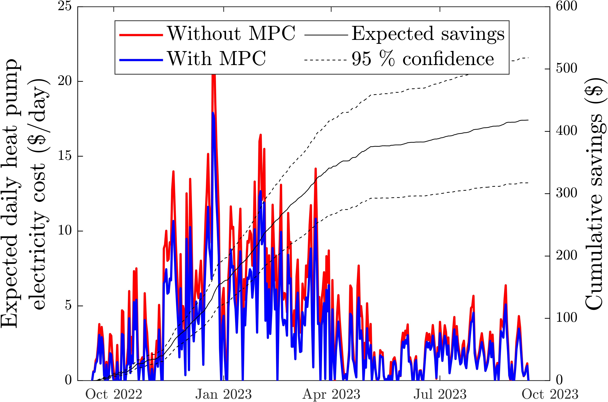
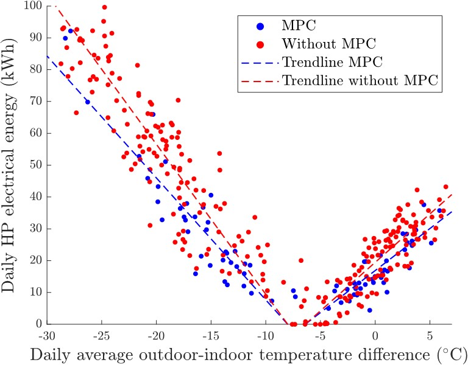
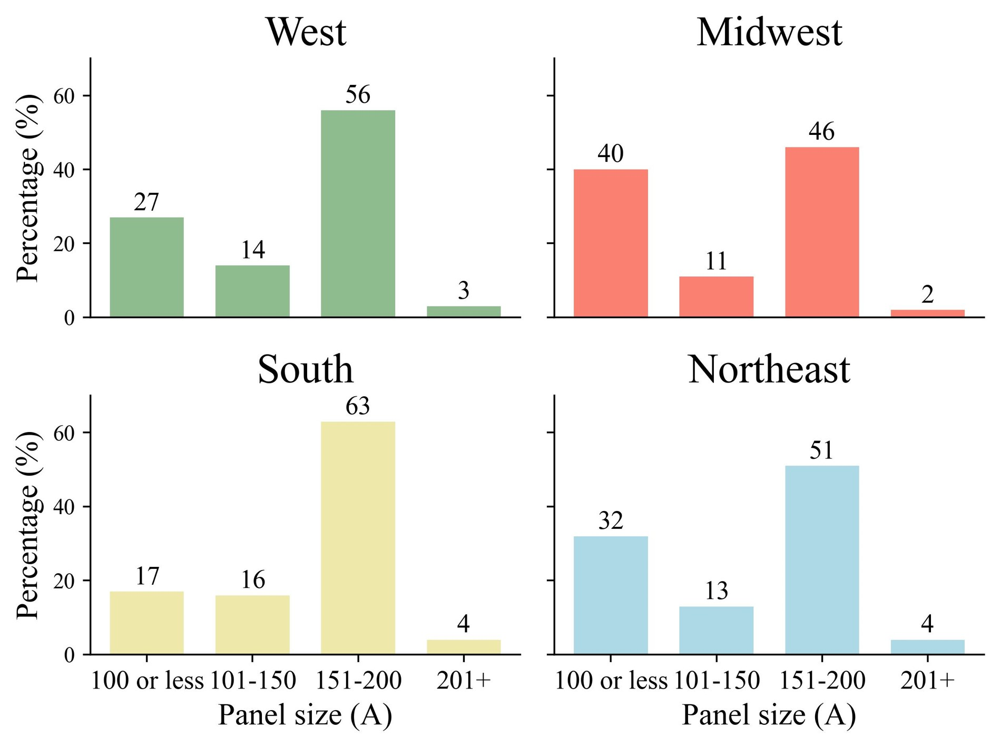
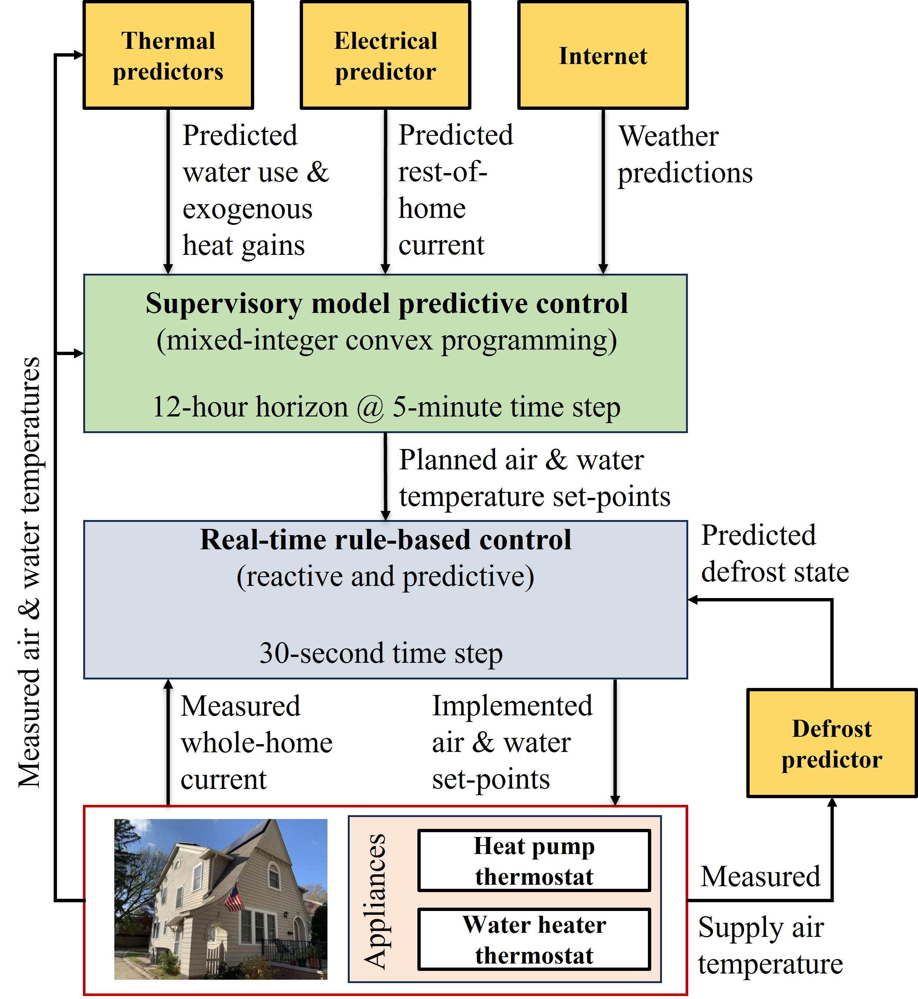

 

**Advanced heat pump controls for efficiency improvement**

As part of the Ray. W. Herrick Laboratories, I have been leading the development and testing of smart controls for heat pumps and water heaters at a real home test bed on the Purdue Campus:

  

 

We developed two data-driven controllers (heating and cooling operation), which through fusing identification and machine learning techniques were able to provide significant occupant savings.

  

  

**Whole home multi-device solutions**
Recent work (EPRI 2023), found that as much as 20 million homes in the US in the coming decade will need to upgrade their electrical panel to support electrification of the space conditioning (heat pump), water heating (heat pump water heaters, electric water heaters), electric vehicle on-site charging, etc. They substantiated their findings through survey and models of the current residential building stock in the US, highlighting limitations in cold climate regions due to a reliance to gas furnace and the need for resistive backup heat in the case of heat pumps.

  

In this work, we developed a novel smart controller (USPTO preliminary disclosure) that can coordinate the coordination of multiple on-site assets to ensure buildings operate at a much smaller breaker panel rating than current NEC standards require, and in the case of the test-site on the Purdue campus, the breaker panel before its complete electrification (100 A), with a current rating of 200 A. With the cost of a breaker panel being in the order of $2-10,000, this technology can potentially save millions of dollars for homeowners without the need for any hardware additions.

  

