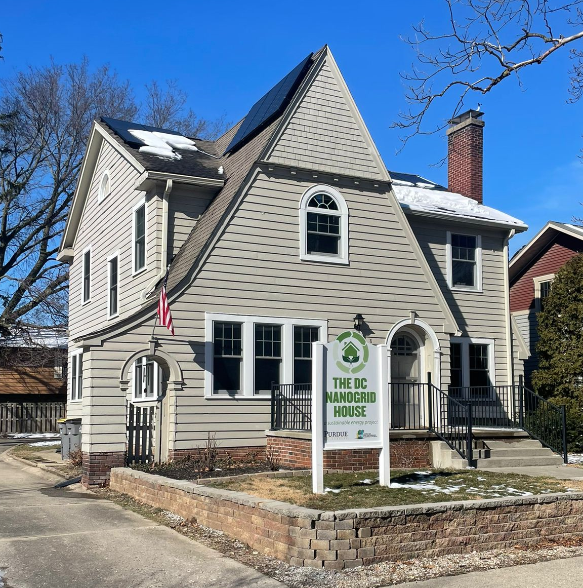
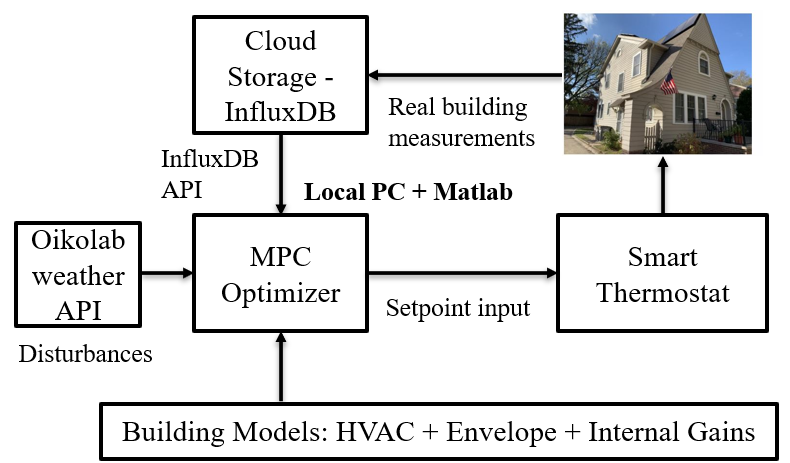
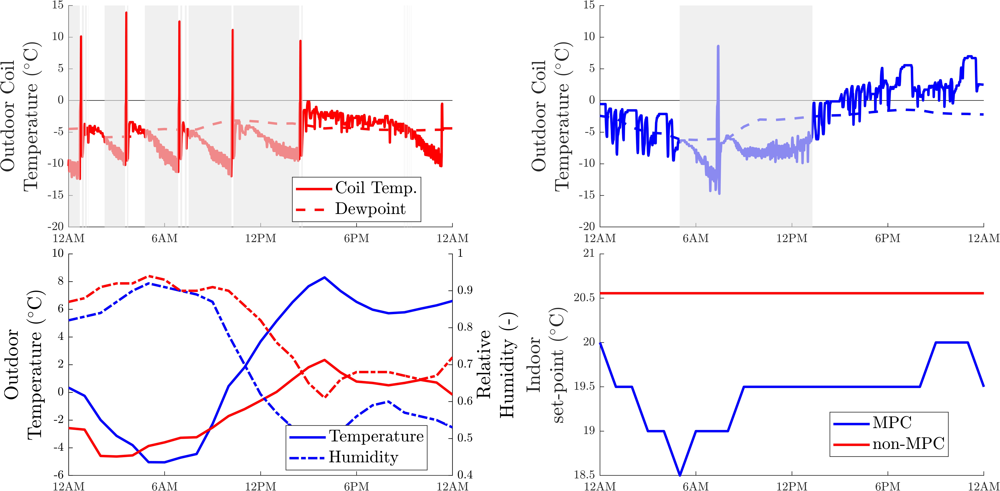
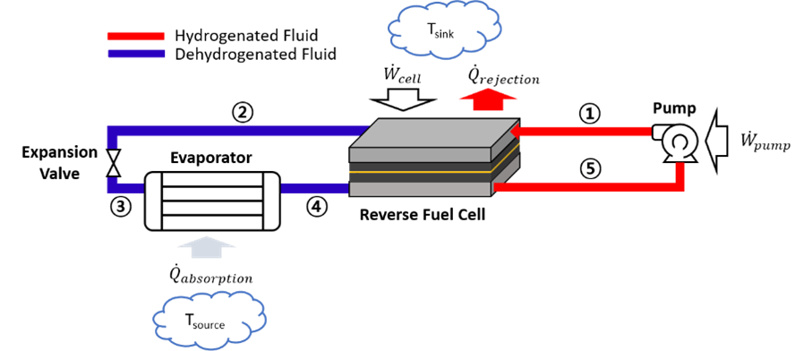
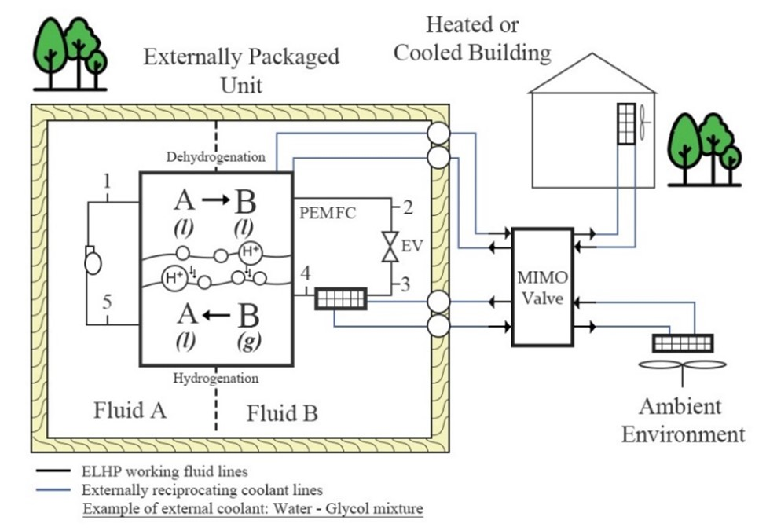
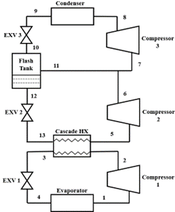

**Advanced heat pump controls for efficiency improvement**

As part of the Ray. W. Herrick Laboratories, I have been leading the development and testing of smart controls for heat pumps and water heaters at a real home test bed on the Purdue Campus:

  

 

We developed two data-driven controllers (heating and cooling operation), which through fusing identification and machine learning techniques were able to provide significant occupant savings.

  

 

  

**Whole home multi-device solutions**

A <a href="https://www.epri.com/research/products/000000003002026736" target="_blank" style="color: black; text-decoration: underline;">recent EPRI report</a>, found that as much as 20 million homes in the US in the coming decade will need to upgrade their electrical panel to support electrification of the space conditioning (heat pump), water heating (heat pump water heaters, electric water heaters), electric vehicle on-site charging, etc. They substantiated their findings through survey and models of the current residential building stock in the US, highlighting limitations in cold climate regions due to a reliance to gas furnace and the need for resistive backup heat in the case of heat pumps.

  

In this work, we developed a novel smart controller (USPTO preliminary disclosure) that can coordinate the coordination of multiple on-site assets to ensure buildings operate at a much smaller breaker panel rating than current NEC standards require, and in the case of the test-site on the Purdue campus, the breaker panel before its complete electrification (100 A), with a current rating of 200 A. With the cost of a breaker panel being in the order of $2-10,000, this technology can potentially save millions of dollars for homeowners without the need for any hardware additions.

  

**Thermal equipment, communication protocols and other work**

During my PhD and my internship at the Advanced Technology Group of Lennox International (Carrollton, Texas), I have been involved in multiple projects, including defrost modeling, an advanced controller for backup heat in heat pumps (to improve comfort), equipment A2L leakage testing, sensor integration, and cloud storage, advanced cycle architecture designs.

  

Block diagram of a fully networked IoT infrastructure for our test house. We can read measurements from a water heater, a heat pump, a smart thermostat, and an electrical smart meter. This allows us generating all our machine learning and grey box models in our house.

  

A smart rule-based scheduling system for PWM modulation of backup heat supply (USPTO patent pending).

  

First demonstration of frost regulation through smart set-point adjustment, a journal presentation is in the making.

  

  

The chemical looping heat pump, is a novel electrochemical cycle that uses phase change reactions to avoid the need for a compressor. I worked on advancing the cycle in heating operation, designing the thermal management system of the fuel cell, and finding appropriate working substances.

  

