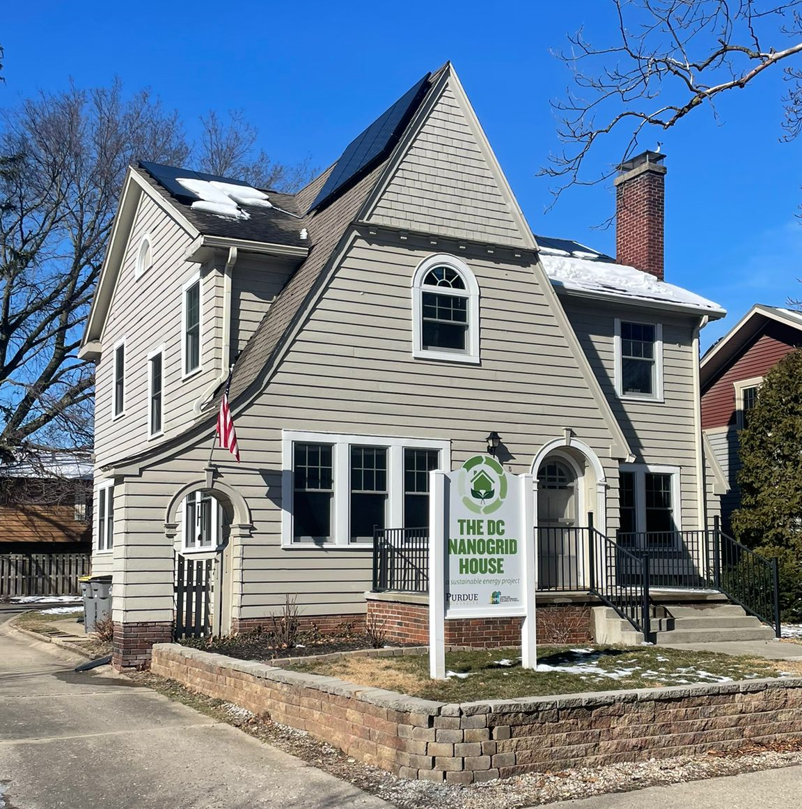
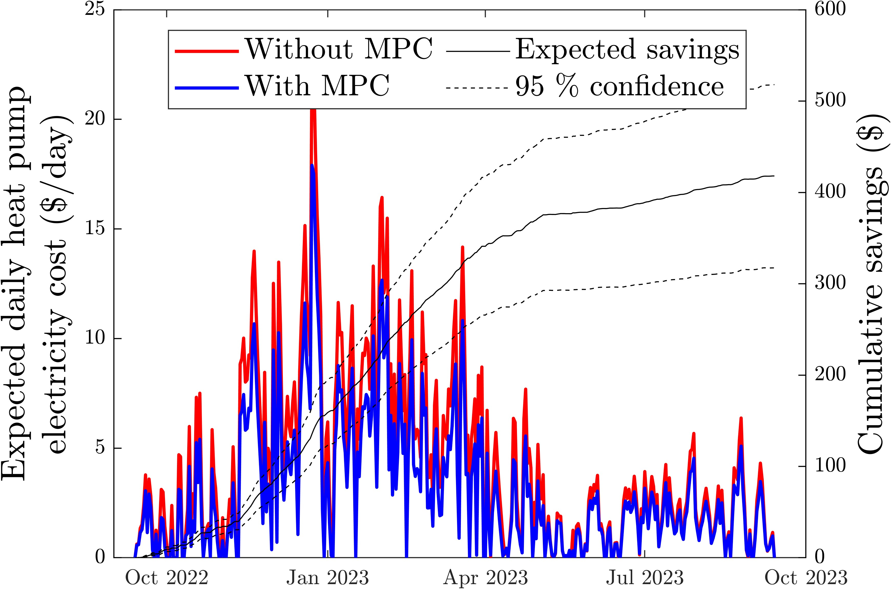
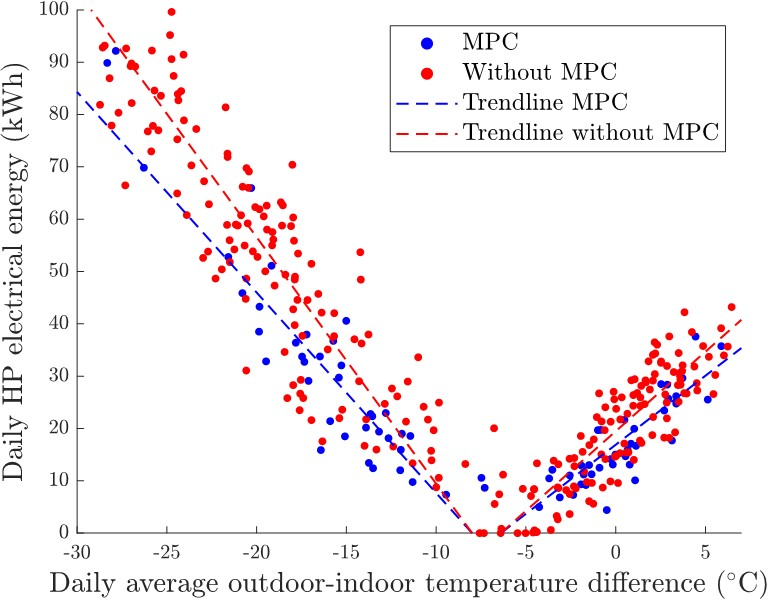
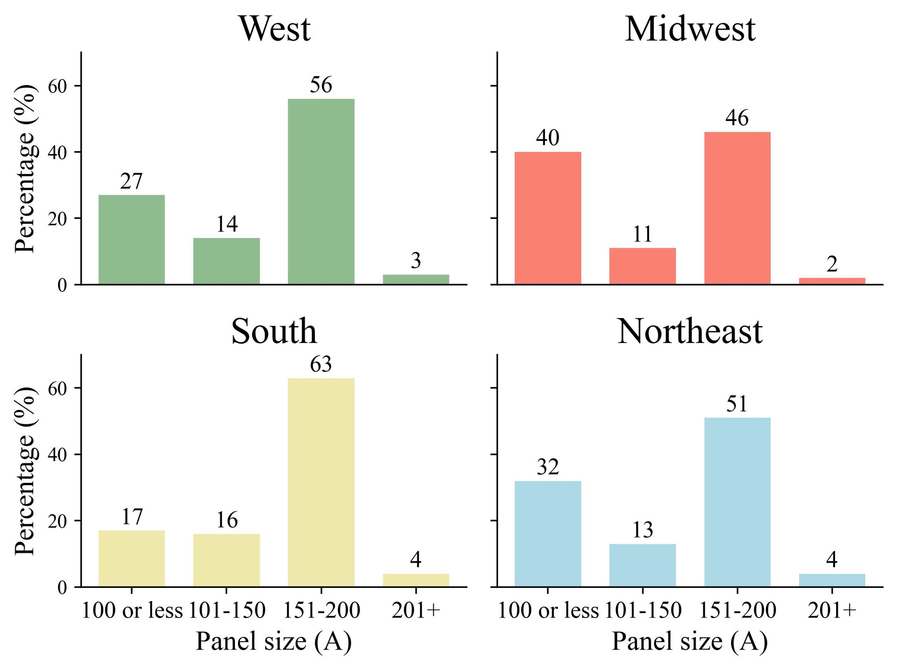
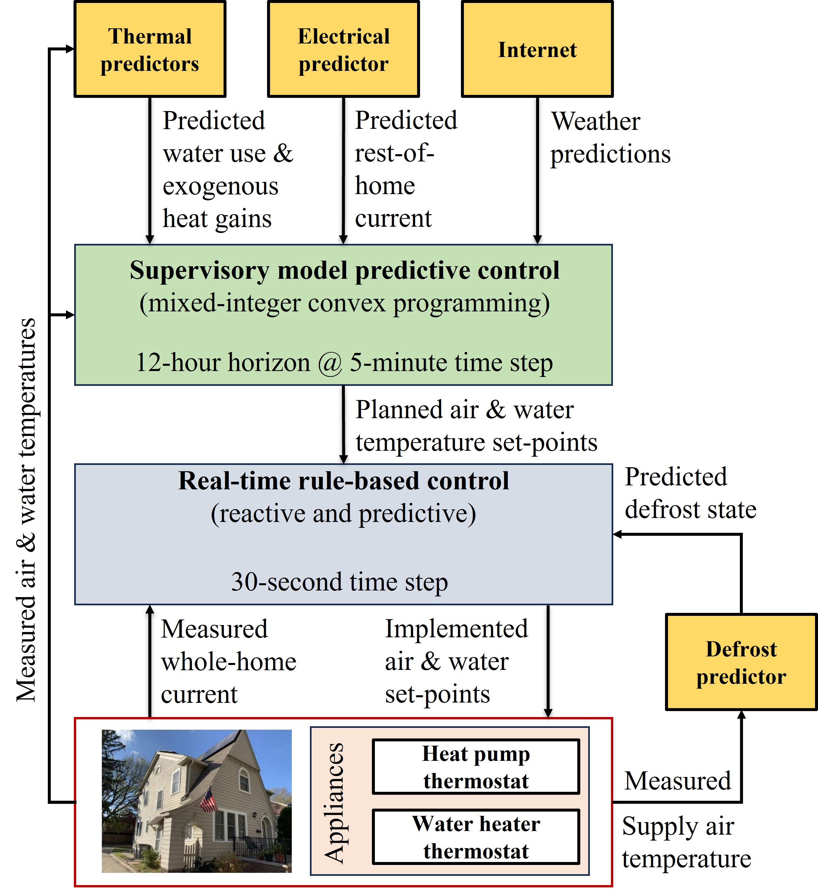
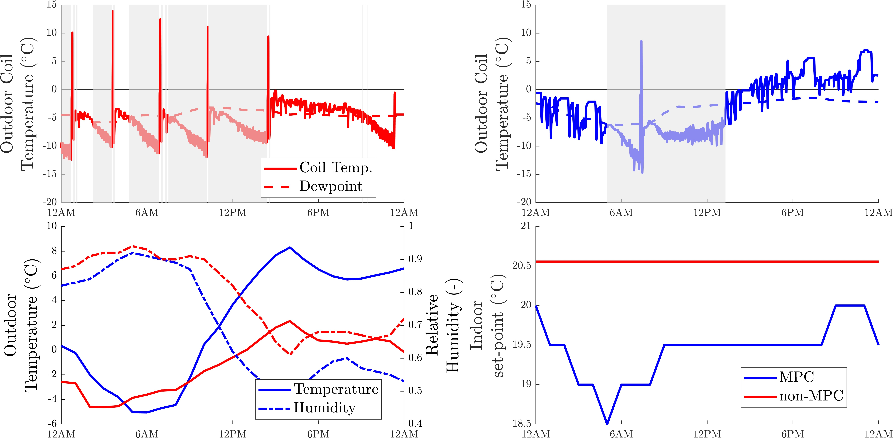
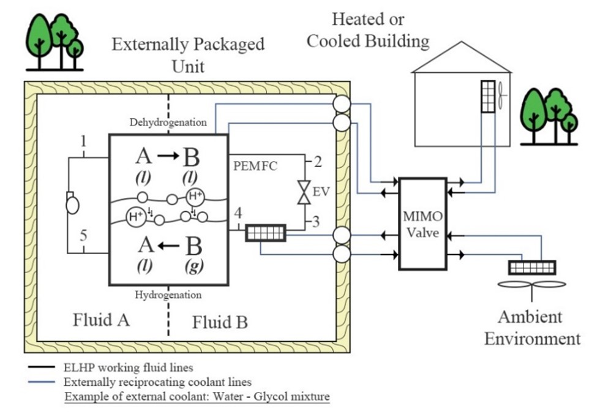
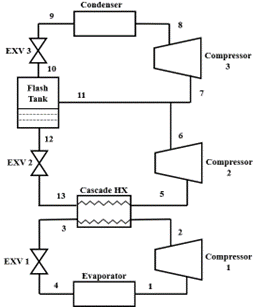

**Smart HVAC and thermostat controls at Trane Technologies**

As a Lead Engineer in the Residential R&D group at Trane Technologies, I develop advanced control algorithms for residential HVAC equipment and smart thermostats. My work spans model identification from lab and field data, model-based and machine-learning-based control (including model predictive control), hardware-in-the-loop (HIL) validation, and production embedded code generated from Modelica and MATLAB/Simulink toolchains. Broader themes include electrification of residential heating, occupant-centric comfort, user-facing energy-saving features, and grid-interactive building operation. Recent contributions have led to five patent applications on smart HVAC, thermostat, and residential energy control.

**Field-validated predictive control for residential HVAC**

At Purdue's Ray W. Herrick Laboratories, I led multi-year field studies of predictive control on a fully-instrumented all-electric test home on the Purdue campus. The controllers combine grey-box thermal models identified from operational data with short-horizon load and weather forecasts, and were validated against thermostat baselines across multiple heating and cooling seasons.

  

 

For heating, we developed and deployed an MPC for an air-source heat pump in a cold-climate winter, achieving significant reductions in electricity use and demand relative to a well-tuned thermostat baseline (<a href="https://doi.org/10.1016/j.apenergy.2024.122820" target="_blank" style="color: black; text-decoration: underline;">Applied Energy, 2024</a>). For cooling, we extended the framework with a humidity-aware formulation that jointly manages sensible and latent loads, validated in a summer field study (<a href="https://doi.org/10.1016/j.buildenv.2024.112093" target="_blank" style="color: black; text-decoration: underline;">Building and Environment, 2024</a>).

  

 

  

Broader lessons from these and related field studies — including a synthesis of what works and what does not when deploying MPC and reinforcement learning on real residential and commercial HVAC systems — are documented in a recent review in <a href="https://doi.org/10.1016/j.apenergy.2025.126459" target="_blank" style="color: black; text-decoration: underline;">Applied Energy (2025)</a>.

**Whole-home load coordination and electrical panel protection**

A <a href="https://www.epri.com/research/products/000000003002026736" target="_blank" style="color: black; text-decoration: underline;">recent EPRI report</a> estimated that as many as 20 million US homes will need to upgrade their electrical panel over the coming decade to support the electrification of space conditioning, water heating, and on-site EV charging — with cold-climate regions particularly affected due to reliance on gas furnaces and resistive backup heat. Panel upgrades typically cost thousands of dollars per home.

  

We developed a novel active current-limiting controller that coordinates on-site assets (heat pumps, heat pump water heaters, EV chargers, PV) so a home can operate reliably under a much smaller service rating than current NEC guidance would require — in our test-site case, keeping a fully-electrified home under its original 100 A panel where a 200 A upgrade would otherwise have been needed. The approach requires no hardware additions and is deployable across a wide range of homes. Field results were published in <a href="https://doi.org/10.1016/j.apenergy.2025.125522" target="_blank" style="color: black; text-decoration: underline;">Applied Energy (2025)</a>, and a US-wide parametric extension was published at <a href="https://doi.org/10.1088/1742-6596/3140/5/052027" target="_blank" style="color: black; text-decoration: underline;">CISBAT 2025</a>. The controller is covered by a US patent application.

  

**Frost mitigation through smart load regulation**

Frost accumulation on outdoor coils is one of the largest sources of efficiency loss and comfort degradation for air-source heat pumps in cold and humid climates. We demonstrated that active load regulation — using a smart controller to modulate the operating point of the heat pump — can materially reduce frost accumulation without hardware changes, published at <a href="https://link.springer.com/chapter/10.1007/978-3-032-10546-2_8" target="_blank" style="color: black; text-decoration: underline;">CLIMA 2025 (Milan)</a>, with an extended journal version in preparation.

  

**Novel thermodynamic cycles**

Alongside my controls work, I contributed to two novel thermodynamic-cycle projects during my PhD. The <a href="https://www.energy.gov/eere/buildings/articles/no-vapor-compression-electrochemical-looping-heat-pump-novel-hp" target="_blank" style="color: black; text-decoration: underline;">electrochemical looping heat pump</a> replaces the mechanical compressor with a phase-change electrochemical reaction; I worked on advancing the cycle in heating operation, designing the thermal management system, and screening working substances. Separately, I proposed a modification to the standard cascade cycle for <a href="https://heatpumpingtechnologies.org/news/1/58534/" target="_blank" style="color: black; text-decoration: underline;">high-temperature heat pumps</a>, introducing an open economizer to the upper loop to improve efficiency and expand the safe operating envelope of the compressor at minimal added cost.

  

  

